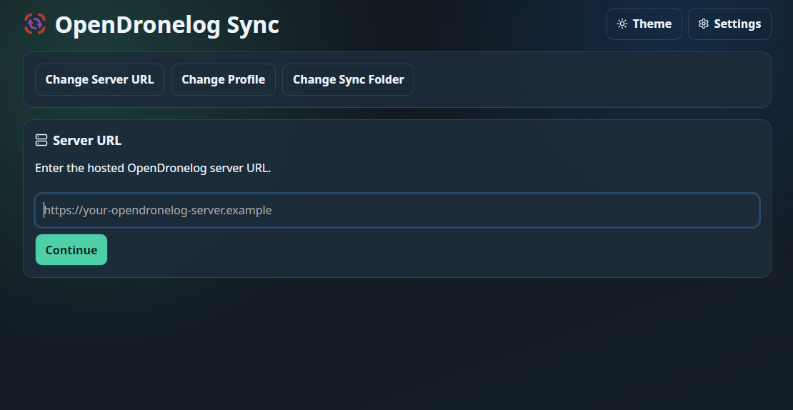
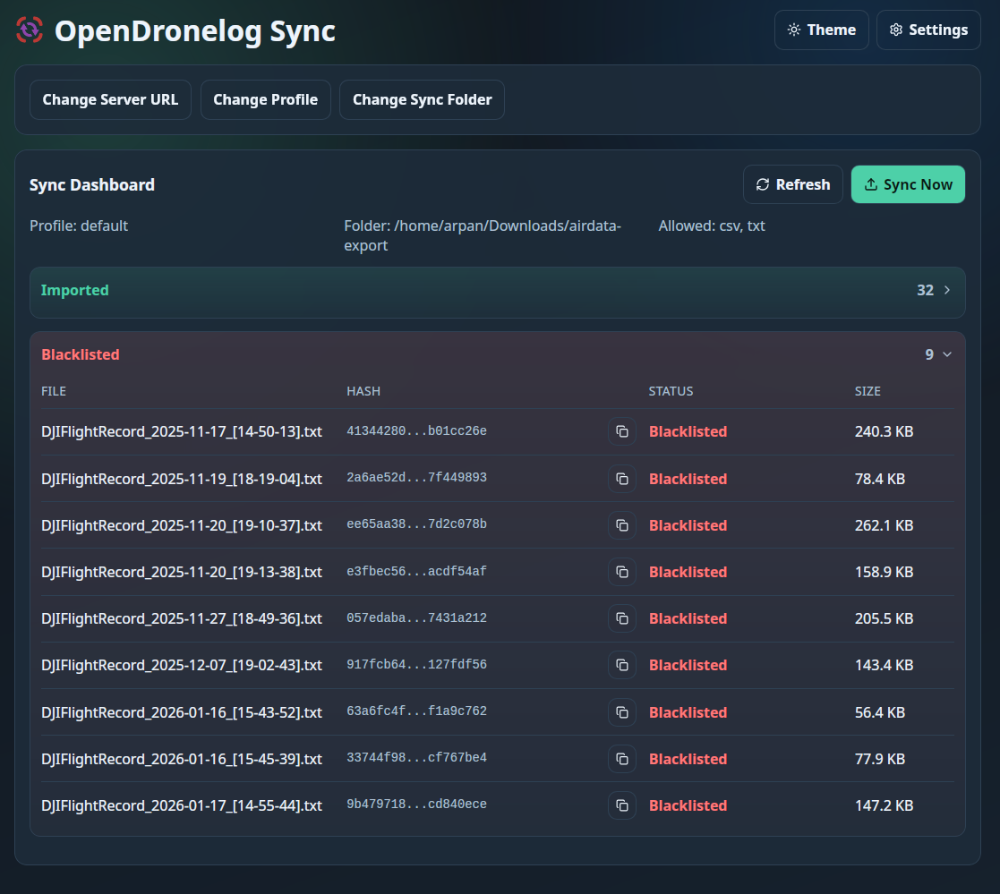
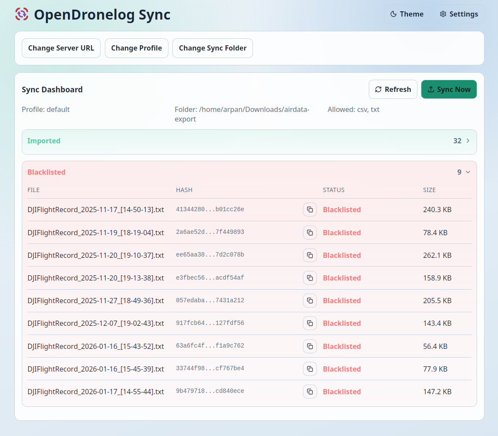

<p align="center">
	
</p>

<H1 align="center"> OpenDroneLog Sync </H1>

<p align="center">
	<a href="https://github.com/arpanghosh8453/opendronelog-sync/releases">
		
	</a>
</p>

<p align="center">Cross-platform sync client for hosted <a href="https://github.com/arpanghosh8453/open-dronelog#docker-deployment-self-hosted-web">OpenDronelog server</a> deployments.</p>

## Platforms

- Desktop: Windows, macOS, Linux (Tauri v2)
- Mobile: Android APK/AAB (Tauri v2)

## Screenshots







## Release Binaries

GitHub Releases contain files prefixed with `opendronelog-sync_<tag>_...`.

### Desktop
- Linux (`x86_64`): `.AppImage`, `.deb`, `.rpm`, and plain Linux binary artifacts
- Windows (`x86_64`): `.exe`, `.msi`, and plain Windows binary artifacts
- macOS Intel (`x86_64`): `.dmg`, `.app.tar.gz`, and plain Darwin binary artifacts
- macOS Apple Silicon (`aarch64`): `.dmg`, `.app.tar.gz`, and plain Darwin binary artifacts

### macOS Users: "Damaged File" Error Fix

> [!IMPORTANT]
> If you see a message like "OpenDronelog Sync is damaged and can't be opened" on macOS, this is usually Gatekeeper blocking an unsigned app, not a corrupted download.

Method 1:
Right-click the app in Finder and select `Open`, then confirm `Open` in the dialog.

Method 2:
Run this in Terminal (replace with your actual app path):

```bash
xattr -cr /Applications/OpenDronelog\ Sync.app
```

### Android
- The Android workflow builds and signs:
- `opendronelog-sync_<tag>_android-universal.apk`: universal signed APK
- `opendronelog-sync_<tag>_<abi>_android.apk`: signed ABI-specific APKs (for example `arm64-v8a`, `armeabi-v7a`, `x86_64`, `x86`)

### Integrity
- `checksums.txt` is published with desktop release artifacts for checksum verification.

## Tech Stack

- React + TypeScript + Vite
- Rust + Tauri v2
- Native desktop/mobile dialogs and filesystem watcher commands in Rust

## Core Flow

1. Configure server URL
2. Fetch profiles (`GET /api/profiles`)
3. Authenticate profile (`POST /api/profiles/switch`)
4. Configure sync folder
5. Load allowed extensions (`GET /api/allowed_log_extensions`)
6. Scan root of sync folder and hash files
7. Compare with:
- server imported hashes (`GET /api/flights`)
- server blacklist hashes (`GET /api/sync/blacklist`)
8. Group by status: `pending`, `uploaded`, `imported`, `blacklisted`
9. Manual `Sync Now` uploads pending files (`POST /api/import`)

## Session Behavior

- Uses `X-Profile` and `X-Session` headers on protected calls
- On `401`, local session token is cleared and login is shown again

## Local Development

Install dependencies:

```bash
npm install
```

Run desktop app:

```bash
npm run tauri dev
```

Run frontend build:

```bash
npm run build
```

Validate Rust backend:

```bash
cd src-tauri
cargo check
```

## Dependencies

### Frontend
- React 19
- TypeScript
- Vite
- `@tauri-apps/api`
- `@tauri-apps/plugin-dialog`
- `lucide-react`

### Backend
- Rust (stable toolchain)
- Tauri v2
- Native file watcher and hashing/upload commands in Rust (`src-tauri`)

## Love this project?

I'm glad that you're using this sync client. Your interest and feedback mean a lot.

Maintaining and improving this project takes a significant amount of free time. If this tool helps your workflow, please consider:

- Starring this repository to support visibility
- Supporting the maintainer through ko-fi

[](https://ko-fi.com/arpandesign)

## License

AGPL-3.0 - same license model as the parent Open DroneLog project.

## Declaration

Parts of this codebase were developed with AI assistance (including Opus 4.6 and GPT-5.3-Codex) for productivity. The architecture, integration decisions, validation, and ongoing maintenance are manually managed and tested.
